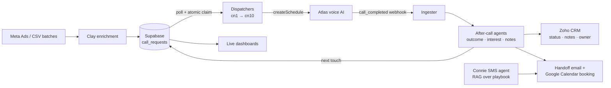

**I build the systems that make revenue teams scale: AI agents that call and text leads, the pipelines behind them, and the dashboards that prove they work.**

📍 Colombia · 🌎 Remote · 🗣️ English / Español

---

### 🧭 What I do

I'm a **Revenue Operations Engineer**. For the last two years I've designed, shipped and operated the automation layer of lending and tax-services companies in the US: outbound AI calling, conversational SMS, CRM automation, lead enrichment, cold email infrastructure and live reporting.

My home turf is **n8n** (self-hosted, 24/7) as the backend, **Supabase / Postgres** as the source of truth, and **LLMs** (DeepSeek, OpenAI, Claude) orchestrated with hard guardrails. I don't train models. I make them reliable in production.

I also build the front end: websites, dashboards, client portals and a native iOS app.

---

### 📈 Results in production

| | |
|---|---|
| 📞 **35K+** outbound AI calls and **130** qualified sales handoffs | voice + SMS funnel, PTS Financial Services |
| 🏢 **1 → 28 branches** on one calling platform, ~13–14K leads per monthly batch | Sunset Finance |
| ⚡ Branch onboarding **30–40 min → 3–5 min**; **18 branches** live in a single day | Sunset Finance |
| 🎯 Call-outcome classifier **45% → 100%** accuracy on a 151-call backtest | PTS Financial Services |
| 🧹 **56 per-branch workflows → 2 workers** with an atomic Postgres claim: **3,123 / 3,123** calls, 0 duplicates | Sunset Finance |
| 💸 AI cost **~$0.0005** per conversational call, because ~77% of calls skip the LLM | Sunset Finance |
| 🚑 Recovered **1,973 / 1,983** silently dropped calls; n8n DB **5.5 GB → 1.3 GB**, CPU **101% → 3%** | Sunset Finance |
| 📨 Own cold email infrastructure: **23 inboxes / 11 domains**, **$200 → ~$88** per month | PTS Financial Services |
| 🔎 **7K+ CRM contacts** enriched from **4,300+ companies** at **$0** in data credits | PTS AI CRM |
| 🖥️ Live dashboard load time **~2.5 min → ~1.5 s** | PTS Financial Services |

---

### 🛠️ Featured work

| Project | What it is |
|---|---|
| 📞 [**ai-voice-sales-funnel**](https://github.com/yeisonmbotero/ai-voice-sales-funnel) | AI voice + SMS lead-qualification funnel: 10 follow-up stages, 130–200-node after-call workflows, LLM classifiers grounded on telephony end-reasons, Google Calendar booking bridge. Case study with 12 production incidents. *n8n · Atlas voice AI · Twilio · Zoho CRM · Supabase · DeepSeek* |
| 🏢 [**multi-branch-call-orchestrator**](https://github.com/yeisonmbotero/multi-branch-call-orchestrator) | Multi-tenant outbound calling for a 28-branch lender: Latin-square cohort scheduler, `FOR UPDATE SKIP LOCKED` dispatch, self-service CSV ingestion, hybrid deterministic + RAG outcome pipeline. *n8n · Postgres · pgvector · Next.js* |
| 📨 [**cold-email-infrastructure**](https://github.com/yeisonmbotero/cold-email-infrastructure) | Cold email stack I built to replace a vendor: domains, DNS (SPF / DKIM / DMARC), inbox provisioning, warmup and runbooks. $200 → ~$88 per month. *Cloudflare · Google Workspace · Smartlead · Clay* |
| 🔌 [**ghl-mcp-server**](https://github.com/yeisonmbotero/ghl-mcp-server) | MCP server for GoHighLevel, backed by a reverse-engineered map of GHL's internal API (259 endpoints from 4,600+ captured calls). *Python · FastMCP* |
| 🏭 [**webfactory**](https://github.com/yeisonmbotero/webfactory) | A website factory: a business URL goes in, and out comes a deployed, audited landing page. The auditor blocks the deploy if the page fails. *Python · Playwright* |
| 🛡️ [**claude-code-security-audit**](https://github.com/yeisonmbotero/claude-code-security-audit) | Security layer for AI coding agents: HMAC-signed drift detection, hook scanner, real-time command guard, skill quarantine. *Python stdlib* |
| 🎙️ [**local-voice-dictation**](https://github.com/yeisonmbotero/local-voice-dictation) | Offline voice dictation with faster-whisper on a global hotkey. Includes the write-ups of two nasty concurrency bugs. *Python · CoreAudio / Win32* |

---

### 🧩 How the voice funnel works

---

### 🧰 Stack

  

  
  
  
  
  
  
  
  
  
  
  
  
  

**Also shipped:** a native iOS app (SwiftUI, ~40K lines) with RoomPlan / ARKit / LiDAR room capture, on-device 360° panorama stitching and a Street View-style tour viewer on a Supabase backend. The product is still pre-launch, so the code is private.

---

### 📊 Activity

  

---

**How I work:** I treat every production incident as a root-cause write-up, not a patch. I verify with data before I call something fixed. And I use AI coding agents (Claude Code) as a daily tool to ship faster without lowering the bar.

⭐ If something here is useful to you, let's talk: [yeisonmbotero@gmail.com](mailto:yeisonmbotero@gmail.com)

